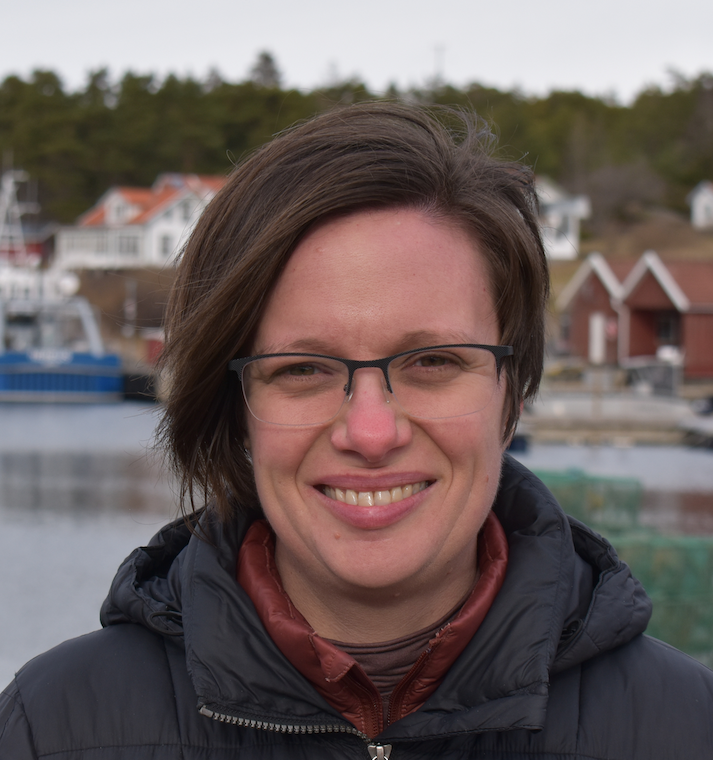
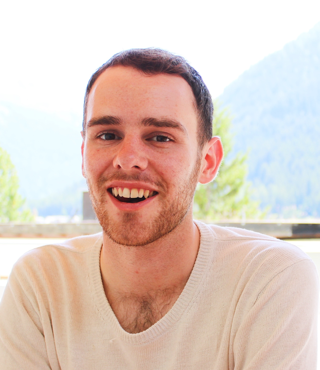
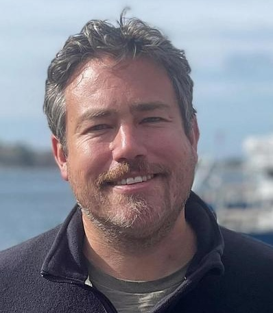
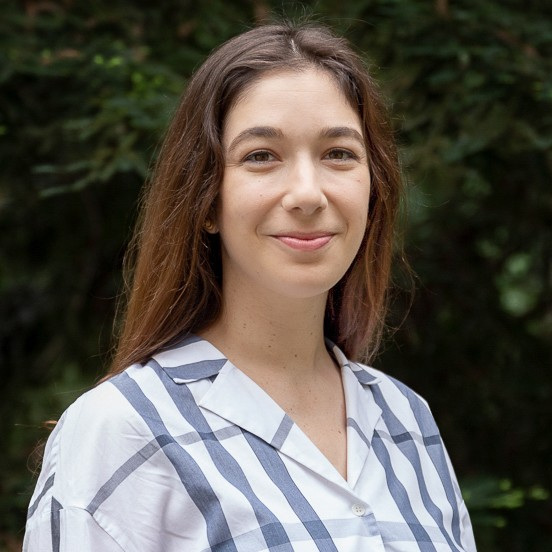
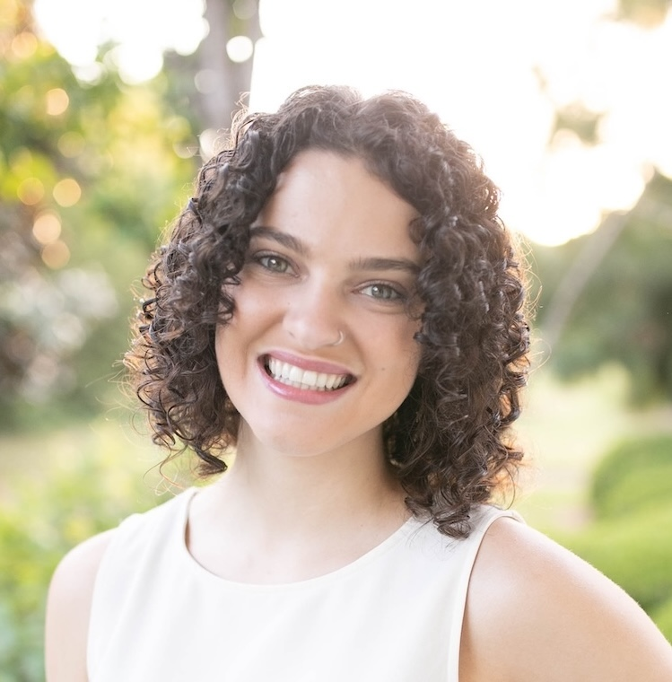
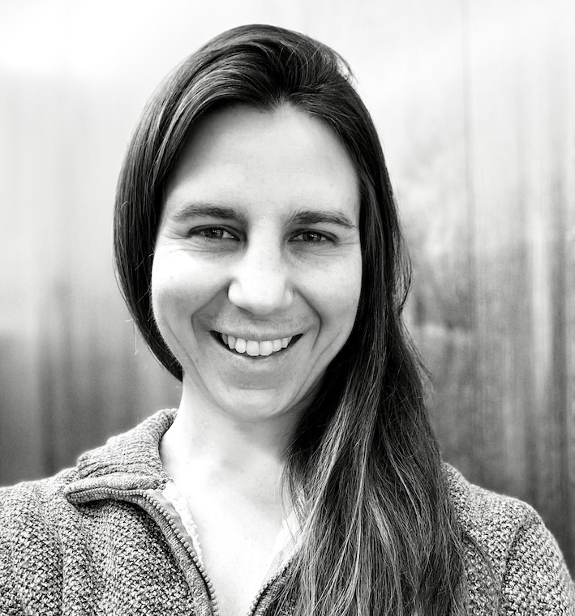
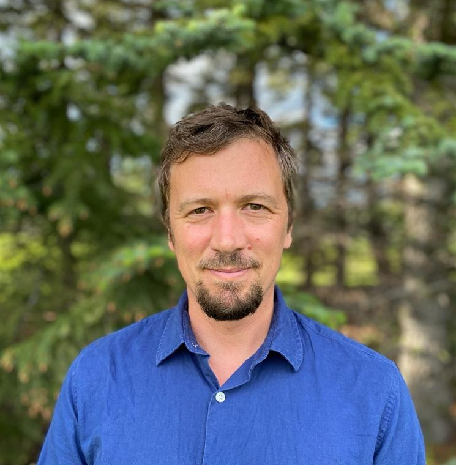

:::::: grid

::: g-col-4

{style="margin: 10px;  border-radius: 90%;"}

Katie E. Lotterhos (Principal Investigator)

Northeastern University Marine Science Center, USA

Director, [Center for Marine Ecological Genomics](https://sites.google.com/view/c-meg/home)

:::

::: g-col-4

{style="margin: 10px; width: 100%; border-radius: 90%;"}
[Sam Bogan](https://snbogan.github.io/)

Skidmore College, USA

Co-Founder, [MarineOmics](https://marineomics.github.io/)

:::

::: g-col-4

{style="margin: 10px; width: 100%; border-radius: 90%;"}

Serena Caplins

Northeastern University

Research Computing

:::
::::::

------------------------------------------------------------------------

::::::: grid
:::: g-col-4

{style="margin: 10px; width: 100%; border-radius: 90%;"}

Pierre De Wit

University of Gothenberg, Sweden

[Center for Marine Evolutionary Biology](https://www.gu.se/en/cemeb-marine-evolutionary-biology)

::::

::: g-col-4

{style="center: left; margin: 10px; width: 100%; border-radius: 90%;"}

Alexa Fredston

University of California, Santa Cruz

Open Science Advocate

:::

::: g-col-4

{style="center; margin: 10px; width: 110%; border-radius: 90%;"} 

Libby Liggins

University of Auckland, New Zealand

[GEOME](https://geome-db.org/)

:::

:::::::

------------------------------------------------------------------------

::::::: grid
:::: g-col-4

{style="center; margin: 10px; width: 110%; border-radius: 90%;"} 

Katherine Silliman

National Oceanic and Atmospheric Administration, USA

Co-Founder, [MarineOmics](https://marineomics.github.io/)

::::

::: g-col-4

{style="center: left; margin: 10px; width: 100%; border-radius: 90%;"}

Rachel Toczydlowski

USDA Forest Service, USA

[GEOME](https://geome-db.org/)

:::

::: g-col-4

{style="center: left; margin: 10px; width: 100%; border-radius: 90%;"}

Sam Yeaman

University of Calgary, Canada

[RepAdapt](https://yeamanlab.weebly.com/repadapt.html)

:::

:::::::

