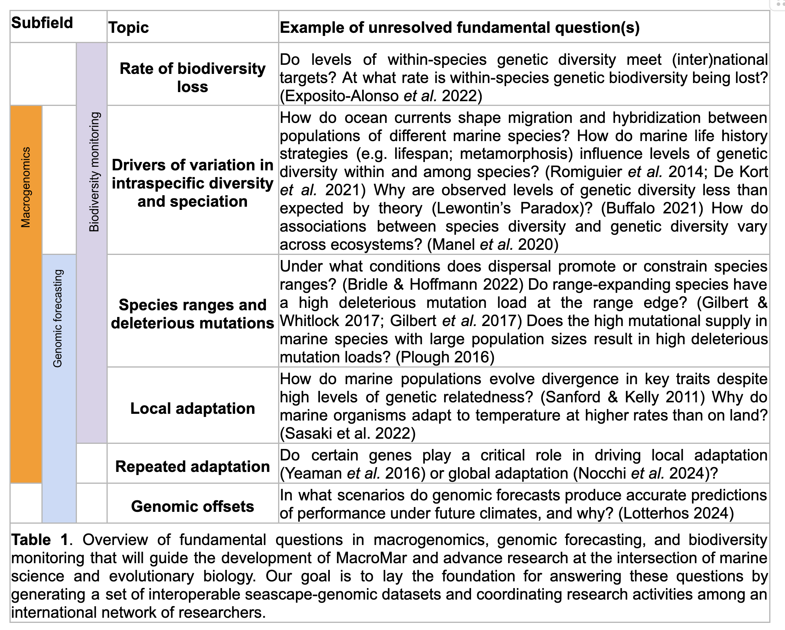

**The goal of this project is to create enabling conditions for macrogenomic studies in the sea by consolidating a set of interoperable seascape genomic datasets for 5000 whole genomes - each with relevant metadata - representative of 100 marine species by 2029 that meet FAIR and CARE data standards. The outcome will enable large-scale, discovery-driven macrogenomic syntheses and facilitate transformative research on the drivers of genetic diversity and structure in marine populations.** Such an endeavor is critical for understanding the oceans because global syntheses in marine systems often reveal different outcomes from terrestrial species that can be counterintuitive. Our project will not only reduce obstacles to macrogenomic research, but will result in coordinated research and educational activities on an international scale with a roadmap for the future.

**Through coordinated research activities, we aim to create the conditions for tackling fundamental, long-standing questions and for testing evolutionary theory.**

## Aim 1

Our first Aim is to build community, coordinate efforts, and establish standards via Regional Foundation Workshop. To coordinate efforts, we will hold a series of virtual meetings leading up to the in person workshops with key folks from the participating networks. The goal of the workshops will be to form working groups that will tackle key topics, such as but not limited to: Indigenous genomic standards/metadata, data interoperability, marine environmental data, AI-term matching, polyploid data, and population genomics of plankton.

## Aim 2

Our second aim focuses on making population genomic data interoperable by running it through the same bioinformatics pipeline and by ensuring associated metadata is in a standardized format. We will support the **Local Research Pods** and use stipend initiatives to promote the completion of projects and to create opportunities for early career researchers.

## Aim 3

Our third aim will be to conduct synthesis of datasets and a horizon scan. A horizon scan identifies developing trends, anticipates risks and opportunities, and develops plans to build resilience against disruptions. We will develop a community roadmap that will define data needs for key questions, identify critical data gaps (e.g., underrepresented taxa) and strategies to address them, develop plans for the sustainability of existing infrastructure, and outline further development of software and infrastructure that will be needed for reproducible, FAIR and CARE-compliant research.

## Membership in our initiative is open to all.
