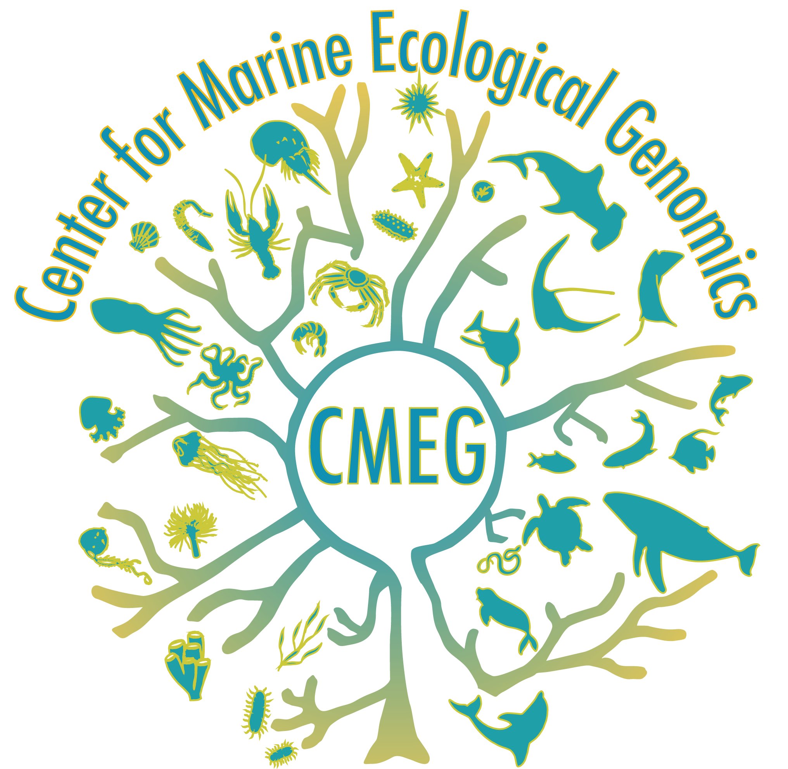
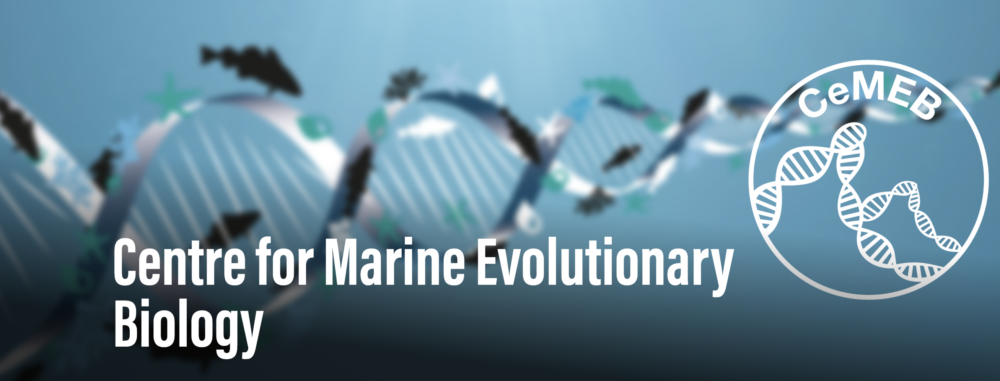

---
---
---

# 

## An open science ecosystem for enabling macrogenomic research in the sea

Macrogenetics is an emerging field that seeks to combine population genomic datasets across species to study genetic variation and biodiversity.

We are an international network of scientists, students, and researchers working to make data FAIR (findable, accessible, interoperable, and reusable), while following best principles for working with local populations and rare or endangered species.

## Our goal is to compile 5,000 whole genomes from 100 species by 2029.

These data will serve as a resource for the community to address major unanswered questions in evolutionary biology using marine systems, which host many phyla not found on land yet remain understudied.

We are grateful to the Moore Foundation for funding our network activities

[{width="300" height="100"}](https://www.moore.org/)

## Partners

[RepAdapt](https://yeamanlab.weebly.com/repadapt.html)

[MarineOmics](https://marineomics.github.io/)

[Aotearoa Genomic Data Repository](https://data.agdr.org.nz/)

[{width="300"}](https://sites.google.com/view/c-meg/home)

